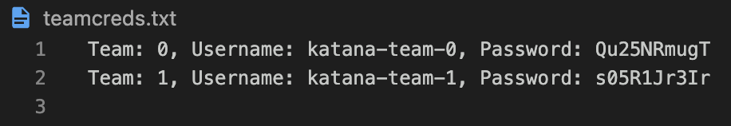

SSH Service enables team to remotely access their own master pod (Tsuka).
Written by [Paradox](https://github.com/Bisht13), It is one of the fundamental components for the working of Katana. 

SSH Service comprises of the following functions, which are explained in detailed

## Setup

During the creation of teams, a `teamcreds.txt` file is generated which contains the team's username and password. This file is present in the root directory of Katana. The password is sent to Tsuka as an environment variable via configmap. This password is the root password for Tsuka as well.



During the setup of Tsuka, the ssh server is setup by installing openssh-server and setting up the password as the root password for Tsuka. `PermitRootLogin yes` is added to `/etc/ssh/sshd_config`. The ssh server is started as a daemon process.

## Connection

For accessing the master pod, the team has to be connected to Katana's VPN. The team can then ssh into their master pod using the following command:

```bash
ssh root@<team-ip>
```

The team can then enter the password provided to them in `teamcreds.txt` to access their master pod.